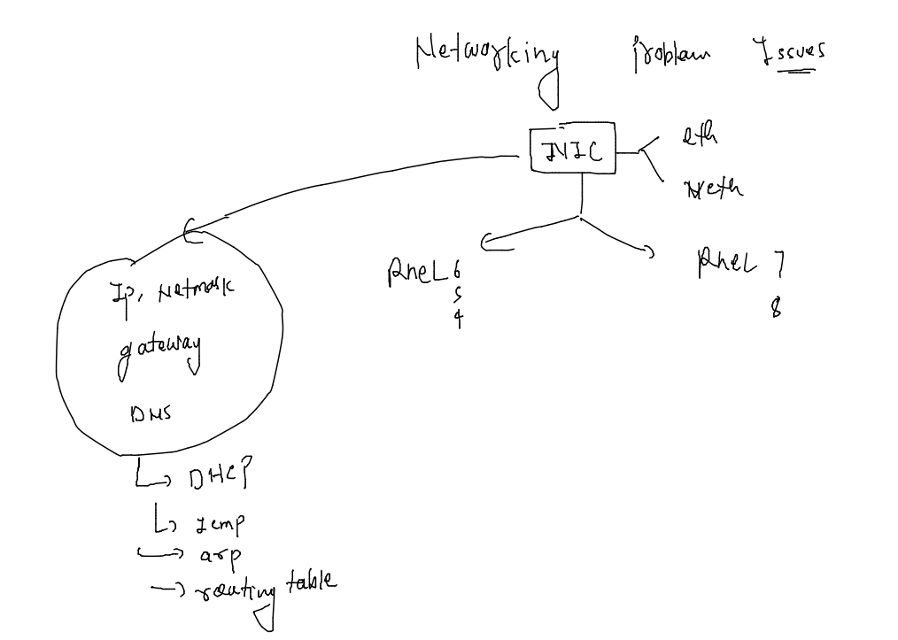
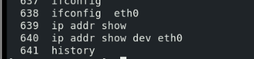
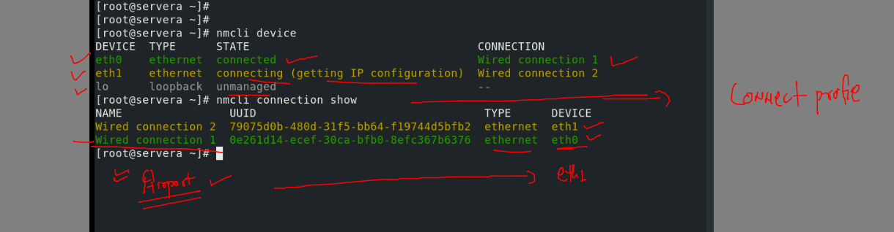
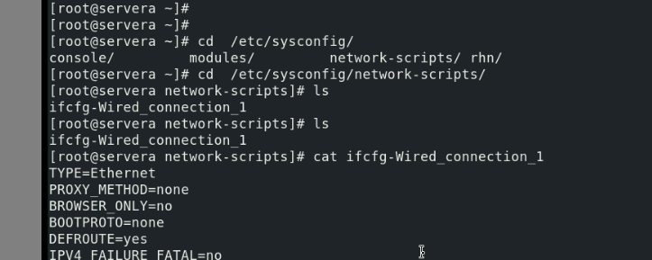
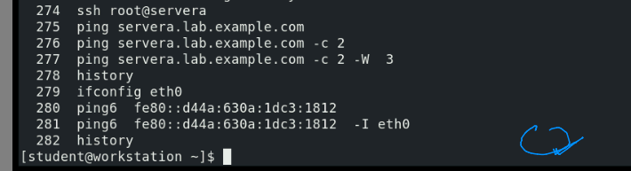
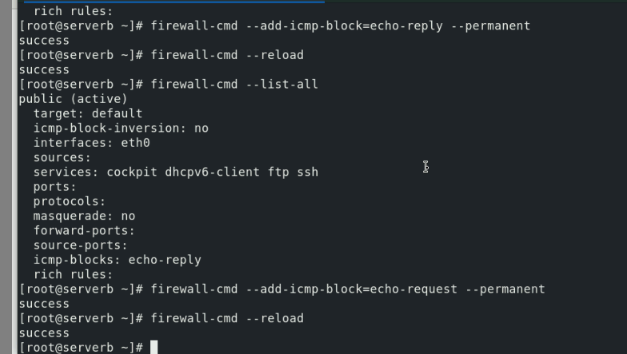
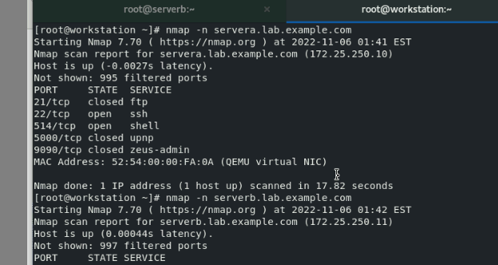
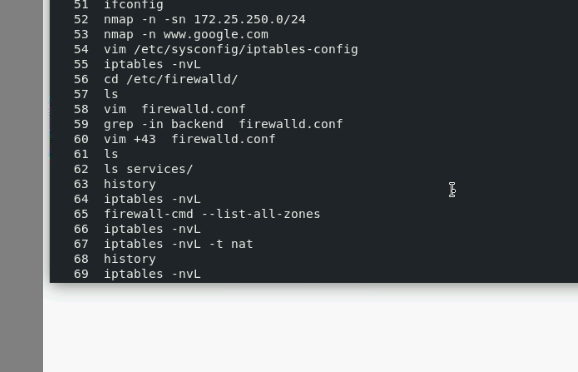
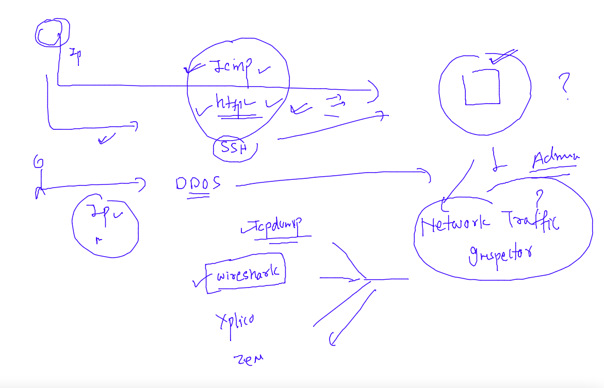
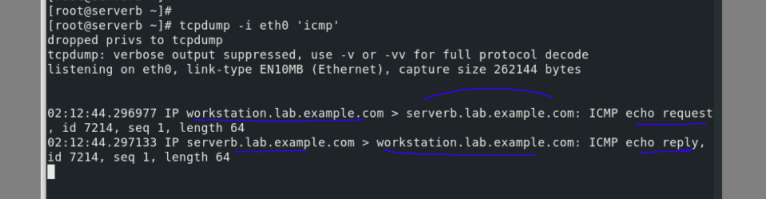

## Training plan 

### Understanding Network tools and Issues in RHEL 

### checking network internface details 

### checking details of network profile and device using nmcli

### Network configuration location 

### using ping utility 

### ICMP block 

## Using Nmap to check host and its port & service status 

### firewalld 

### Network traffic analyzer 

### tcpdump for packet capture 

