## Training plan 

## REvision 

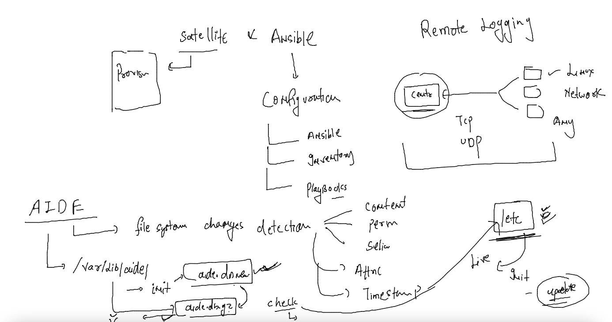

### tip to automate alerting 

### topics 

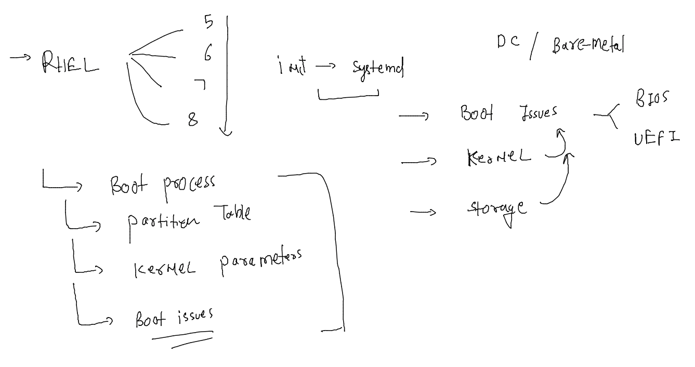

### understanding BIOS -- os boot process 

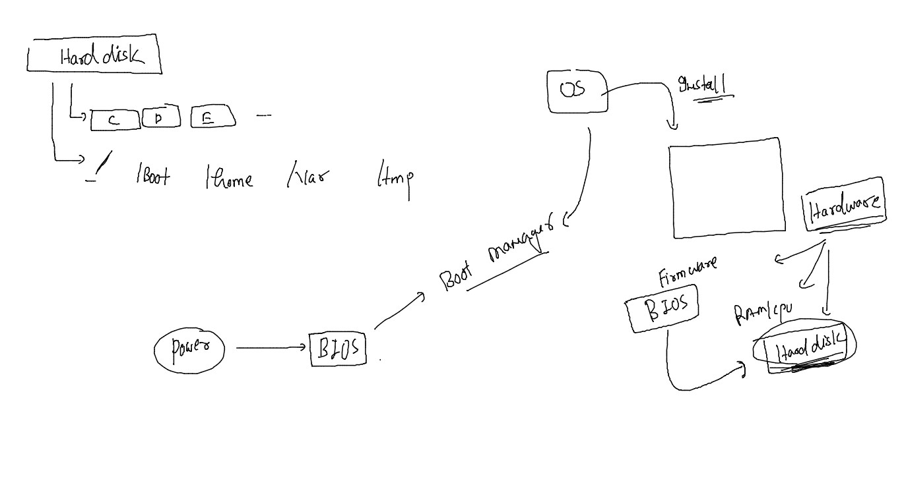

### BIOS -- boot - partition table 

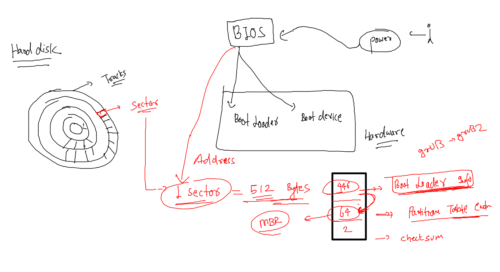

### MBR vs GPT 

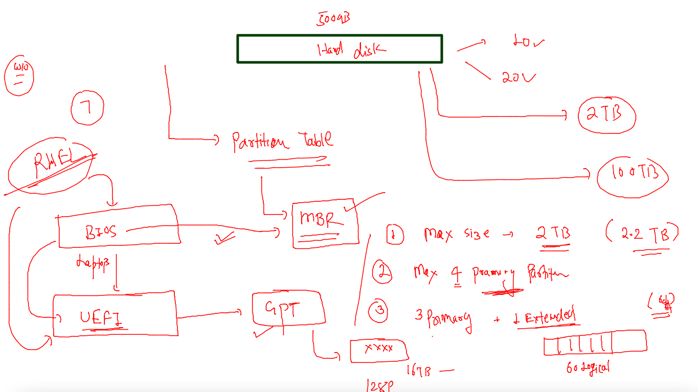

## GRand Unified Boot loader (GRUB)

### GRUB2 with BIOS 

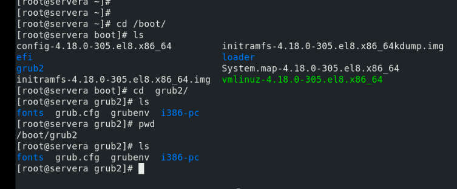

### file to changes grub2 related content 

### boot argument changing 

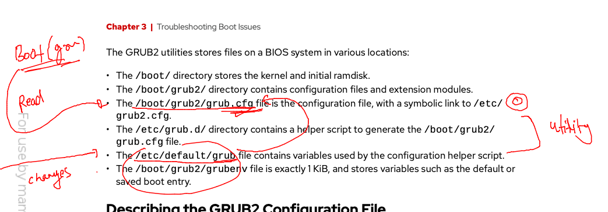

### recreating grub.cfg 

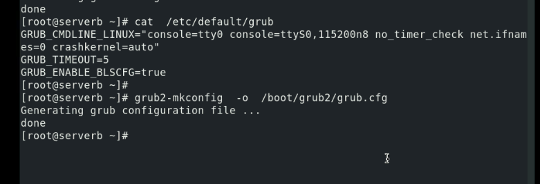

## recover root password on RHEL 7 / 8 

### select boot loader while booting and pass two argument 

### in emergency shell we run below commands 

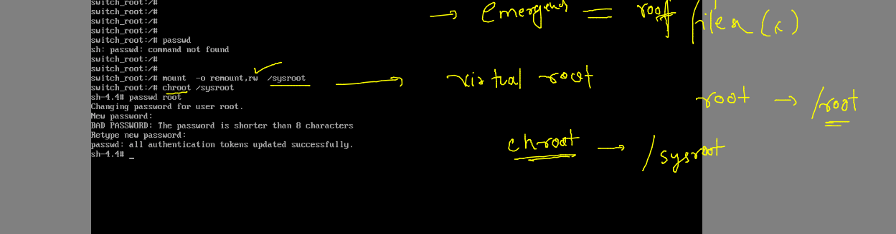

### loging with root and do restart con

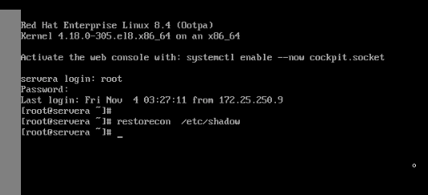

### grubby utility 

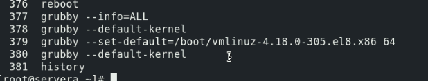

