## Training plan 

### issues listing 

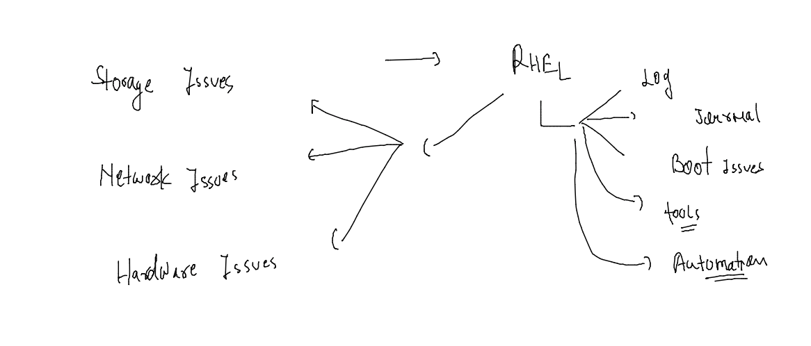

### boot process in RHEL 8/7 

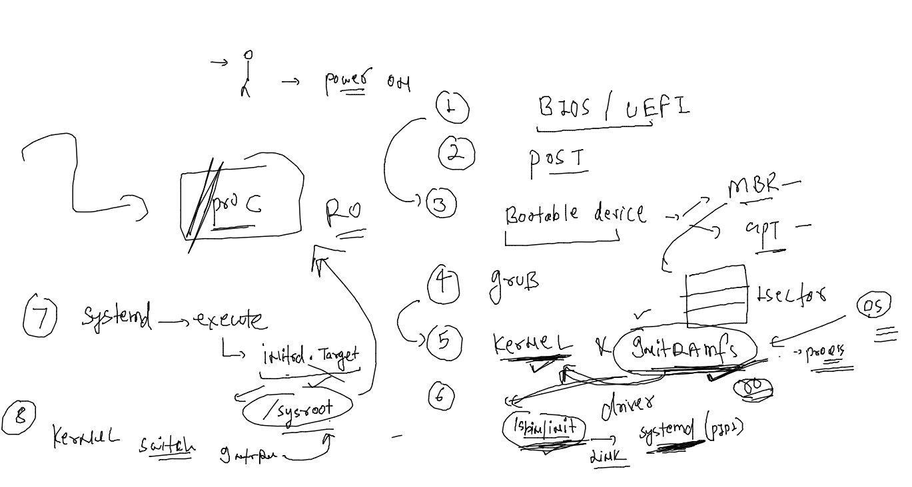

## Storage support in RHEL 

## LInux Kernel storage Stack -- for Any application 

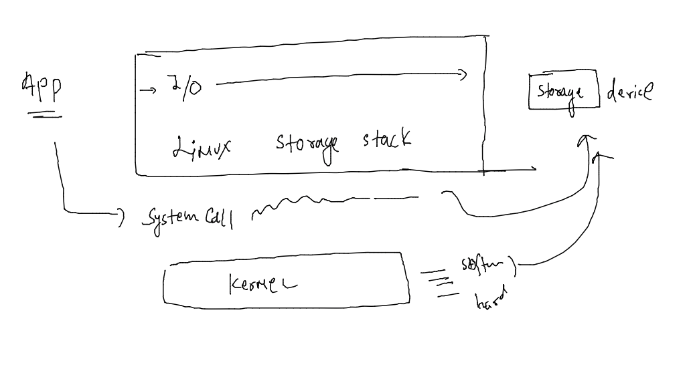

### checking storage stack 

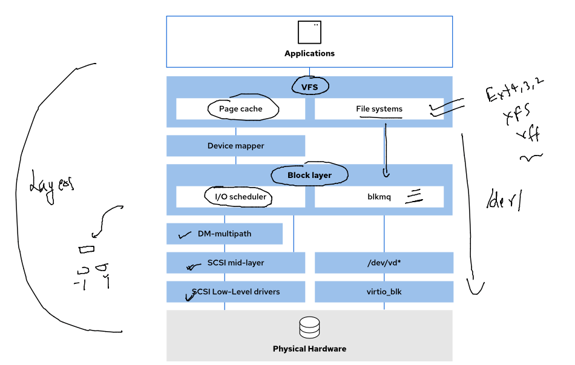

### checking disk schedular and listing it 

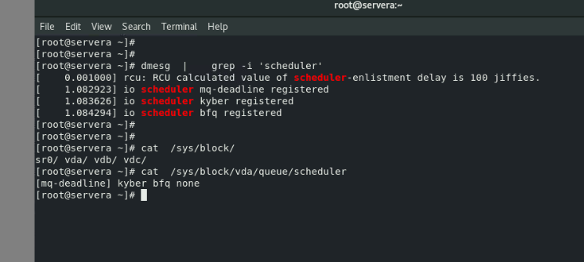

## storage io 

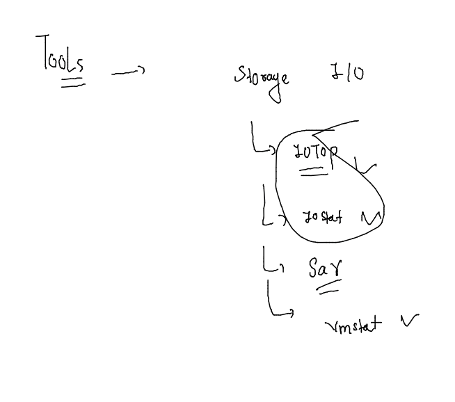

### Stratis in RHEL 

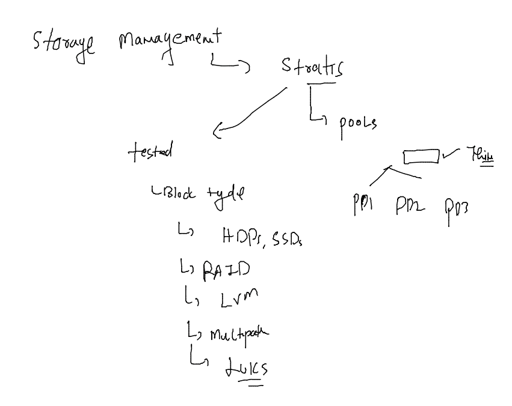

### Installing stratisD 

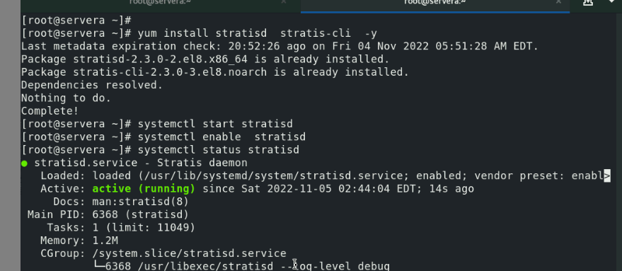

### creating pool , fs and mount it 

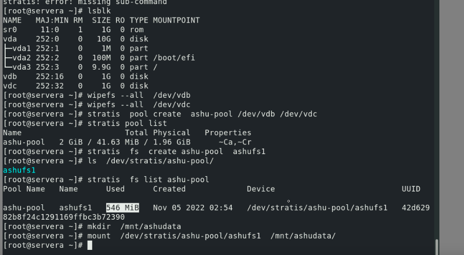

### creating fstab for persistent boot 

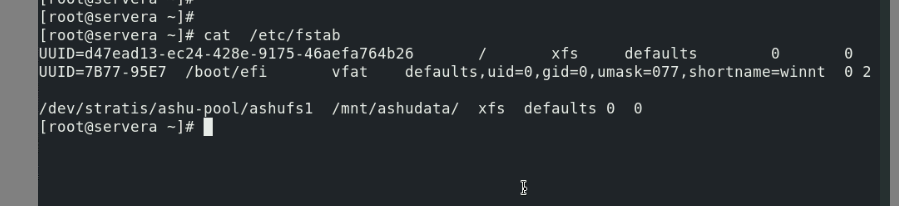

### taking snapshot 

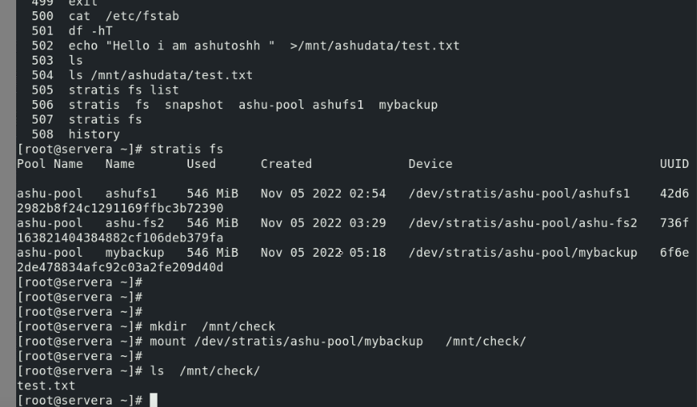

### creating a normal partition 

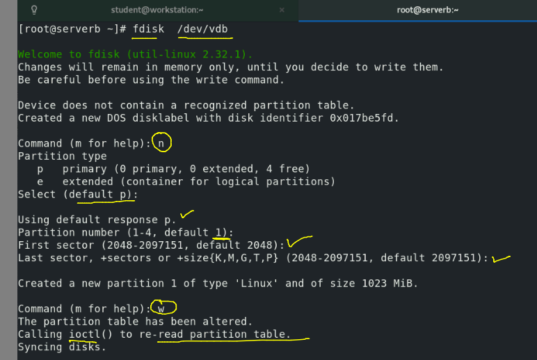

### format with ext4 

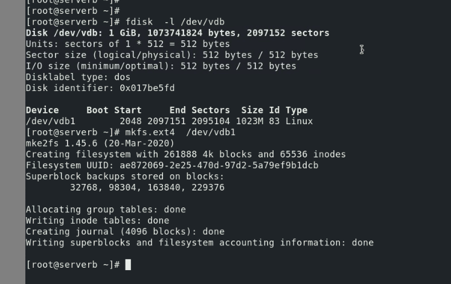

## E2fsck with backup superblock 

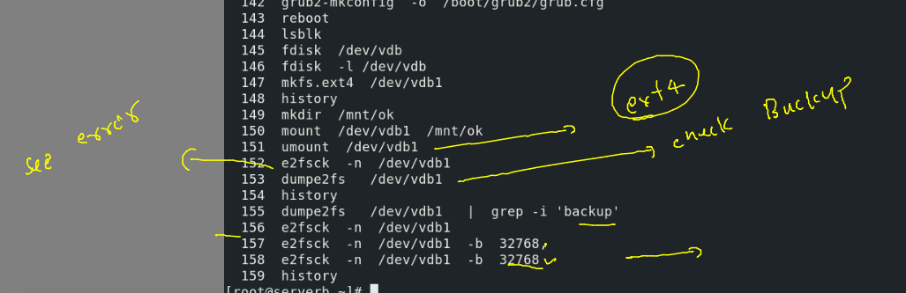

### removing stratis db 

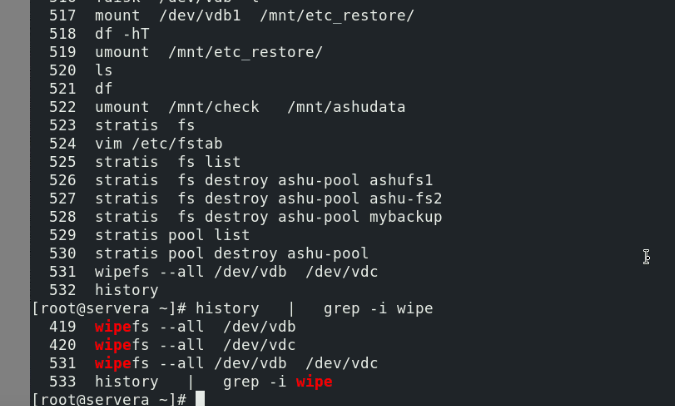

