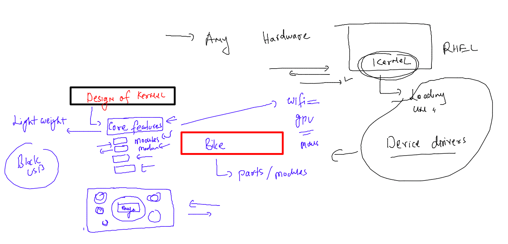
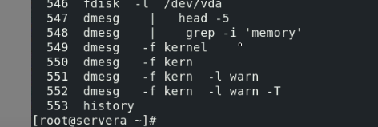
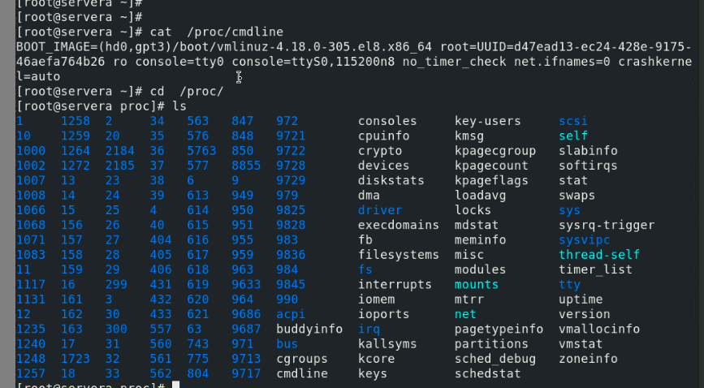
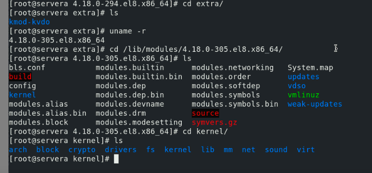
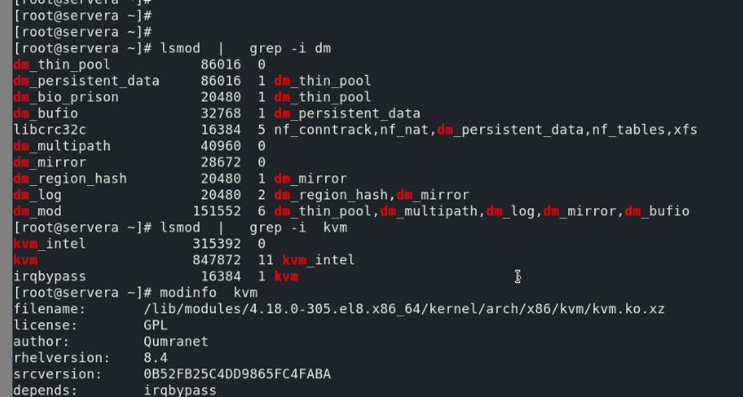
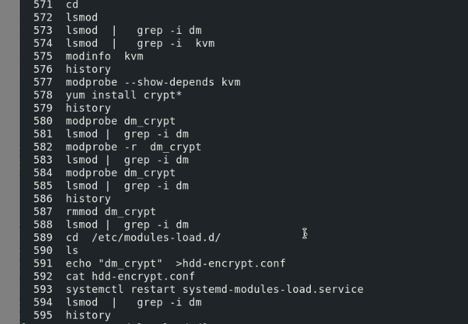
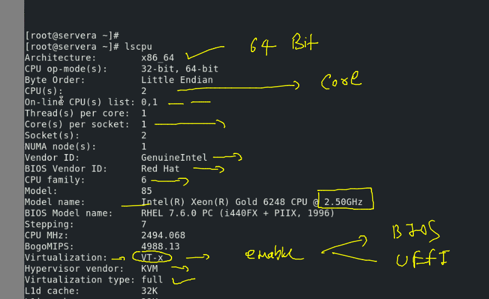

## Training plan 


### issues listing 


### boot process in RHEL 8/7 


## Storage support in RHEL 


## LInux Kernel storage Stack -- for Any application 


### checking storage stack 


### checking disk schedular and listing it 


## storage io 


### Stratis in RHEL 


### Installing stratisD 


### creating pool , fs and mount it 


### creating fstab for persistent boot 


### taking snapshot 


### creating a normal partition 


### format with ext4 


## E2fsck with backup superblock 


### removing stratis db 


## LInux Kernel -- as Modular Design 



### Exploring kernel message using dmesg



### /proc for kernel driver and message 



### exploring more filesystem 



### more info about driver 



### Kernel driver info in detail 



### CPU info 



### more info about storage disk 

```
root@babykool:~# lsscsi -v
[0:0:0:0]    disk    ATA      Secureye SSD     6A0   /dev/sda 
  dir: /sys/bus/scsi/devices/0:0:0:0  [/sys/devices/pci0000:00/0000:00:1f.2/ata1/host0/target0:0:0/0:0:0:0]
list_ndevices: scandir: /sys/class/nvme/: No such file or directory
NVMe module may not be loaded
root@babykool:~# hdparm  -I  /dev/sda

/dev/sda:

ATA device, with non-removable media
	Model Number:       Secureye SSD                            
	Serial Number:      IT20210928256000976 
	Firmware Revision:  U0506A0 
	Media Serial Num:   
	Media Manufacturer: 
	Transport:          Serial, ATA8-AST, SATA 1.0a, SATA II Extensions, SATA Rev 2.5, SATA Rev 2.6, SATA Rev 3.0
Standards:
	Used: unknown (minor revision code 0x011b) 
	Supported: 10 9 8 7 6 5 
	Likely used: 10
Configuration:
	Logical		max	current

```


