## Training plan 

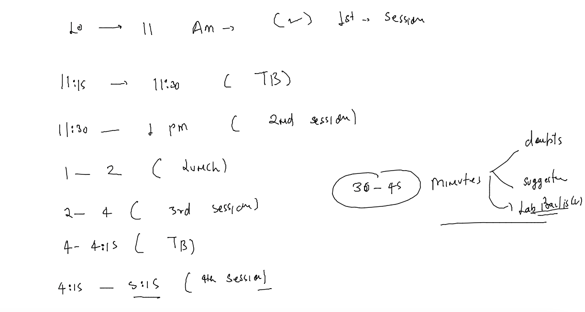

### Revision of  RHEL stanadard cockpit 

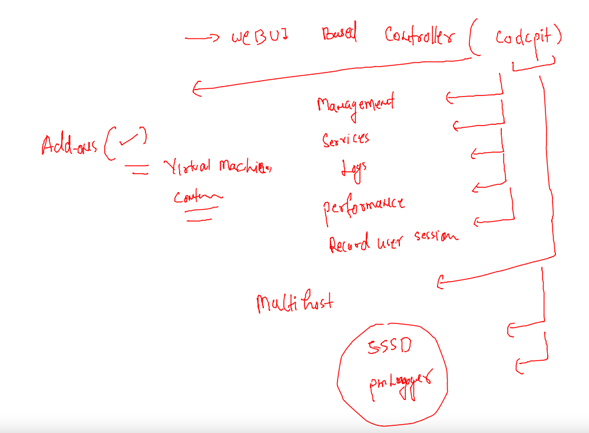

### lets clean up cockpit and reinstall it 

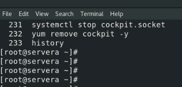

### Reinstalling it 

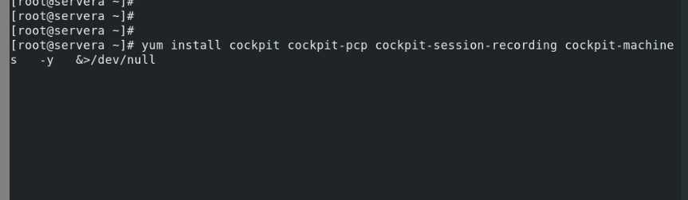

### lets monitor the performance metrics of RHEL system 

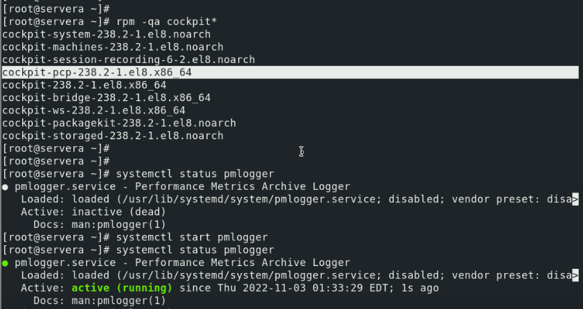

### Session activity recording in RHEL using SSSD along with cockpit 

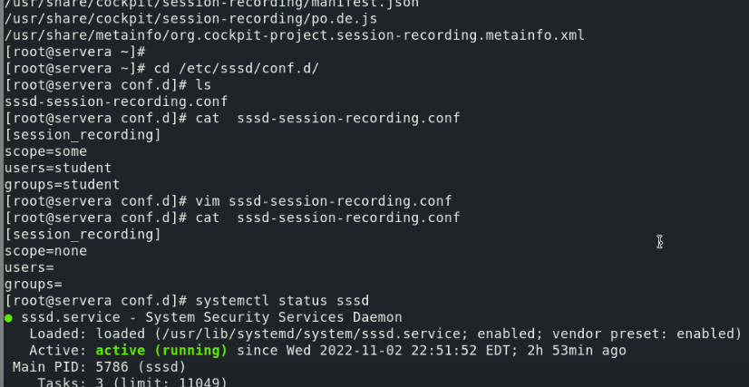

### login to student user for the same 

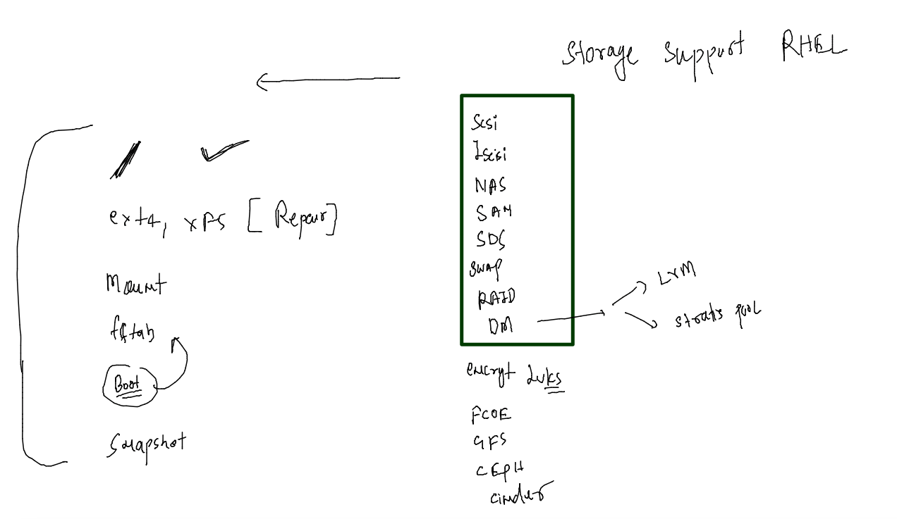

### adding port in FIrewalld and selinux context 

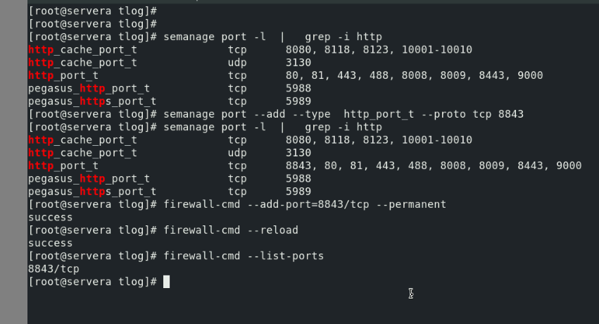

## Centralized / Remote logging 

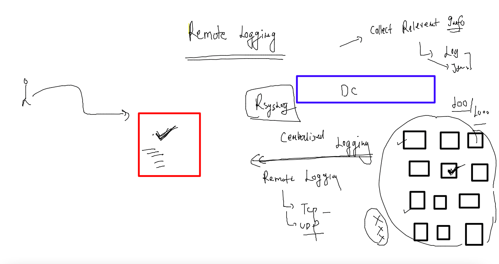

### log severity levels 

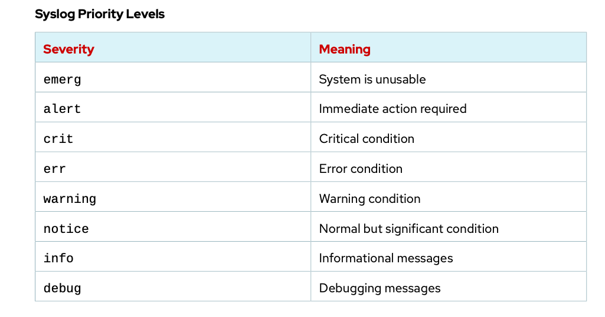

### enable remote logging TCP and UDP 

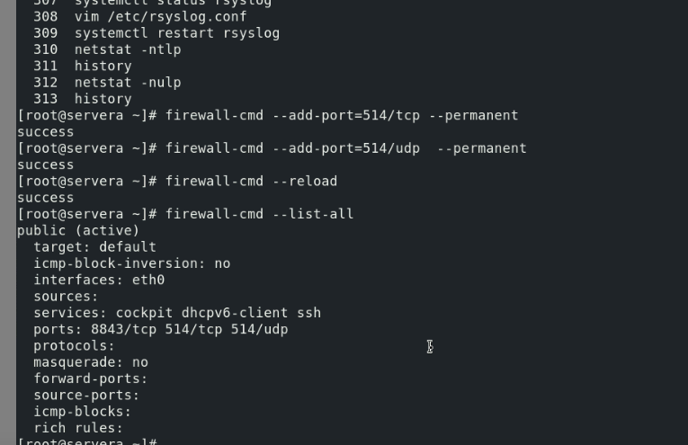

### COnfiguration changes in REmote log server for templating purpose 

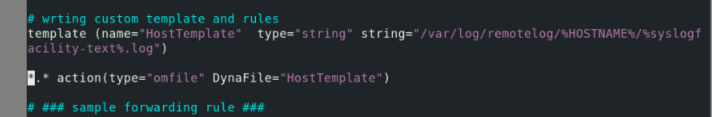

### on log client configuration setup 

## Automation engineering 

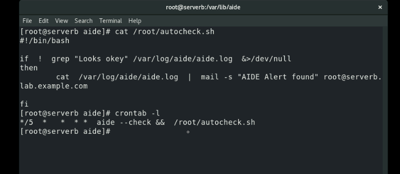

### Redhat satellite & Ansible 

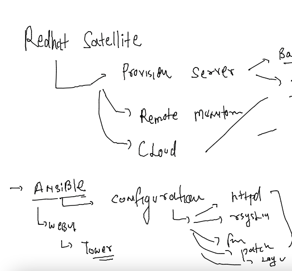

### Deep look into Ansible 

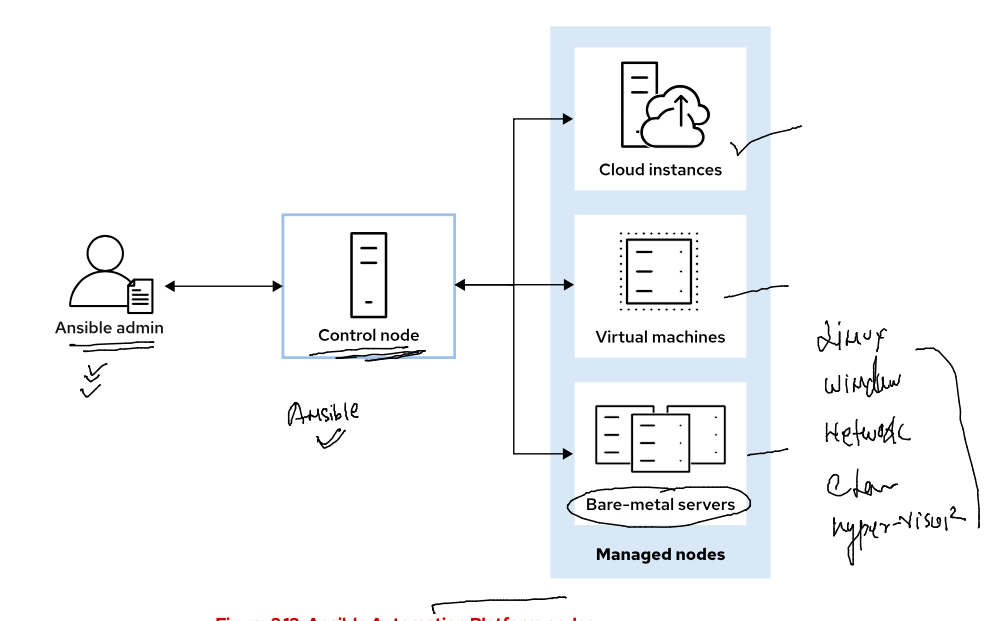

### Ansible Hosts -- conf

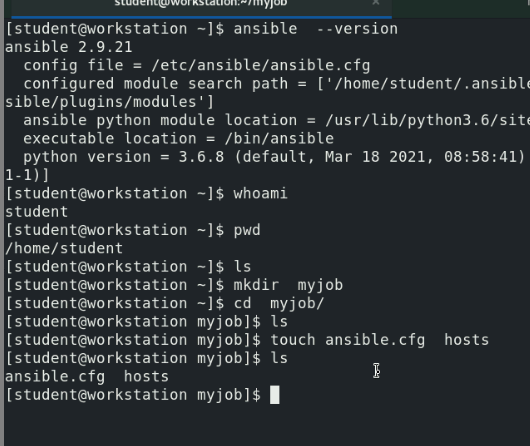

### updating inventory and ansible.cfg file 

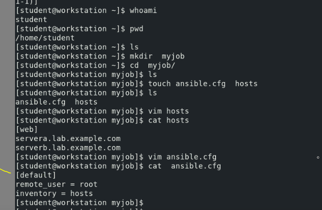

### sample adhoc ansible command 

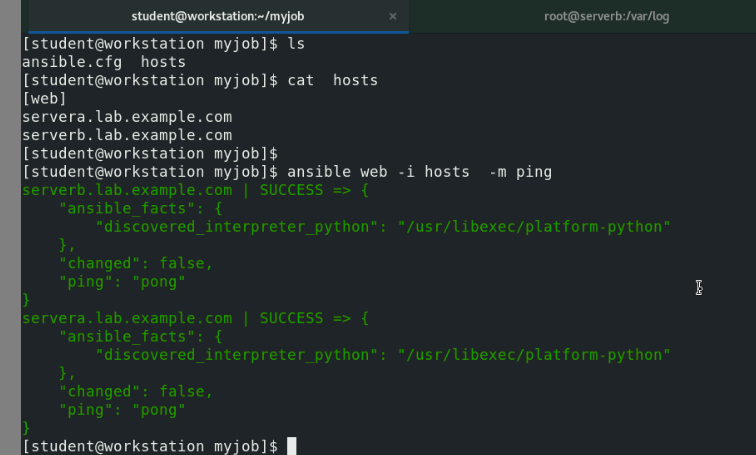

### ansible playbook sample 

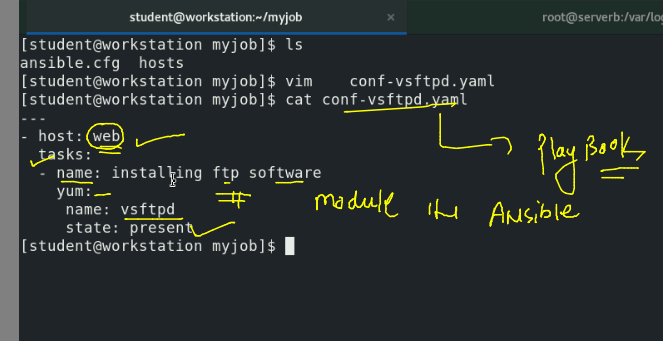

### final playbook and lets run it 

### playbook 

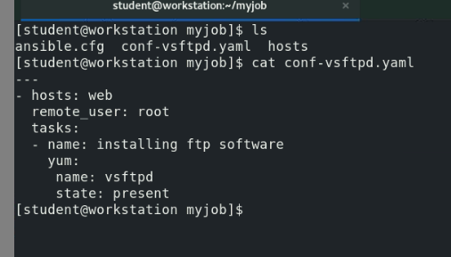

### running it 

### final ansible playbook for complte vsftpd setup 

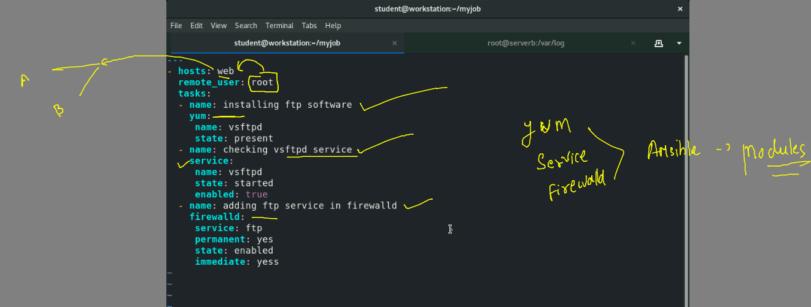

### lets run it 

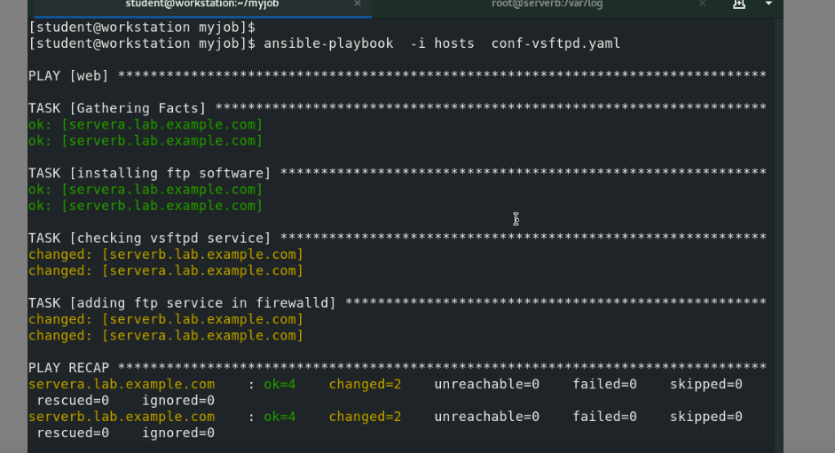

