## Training plan 

###  lab ENV 

### steps  / approach to solve problems or troubleshooting 

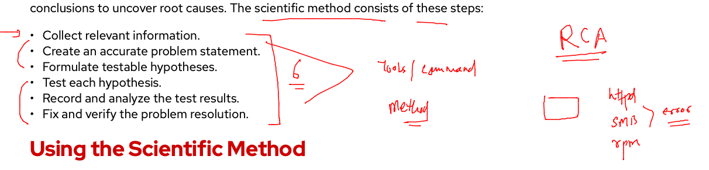

### collecting of relevent Info -- rhel 6 - 7- 8 

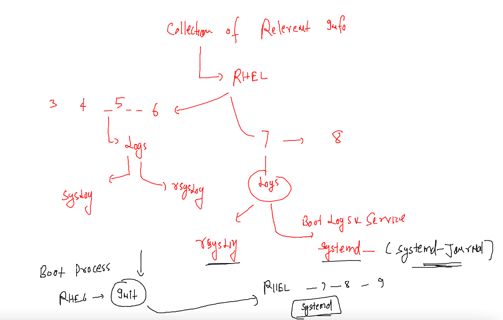

### checking on servera -- for the status rsyslog & systemd-journald

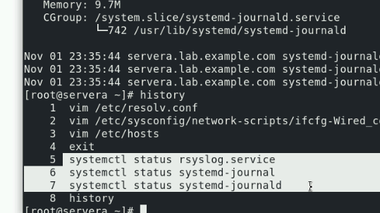

### user need things to login

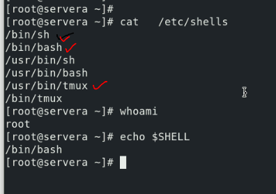

### checking details for student user

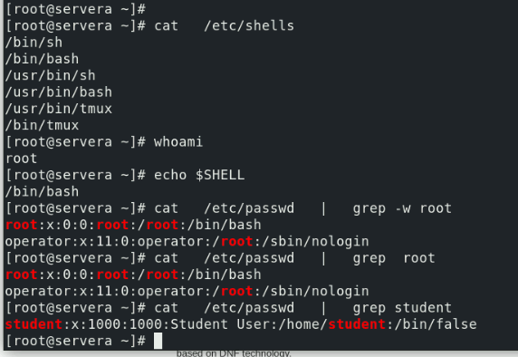

### fixing issues 

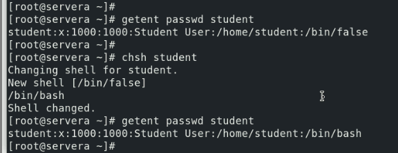

## collecting information for troubleshooting --

### understanding logging methods 

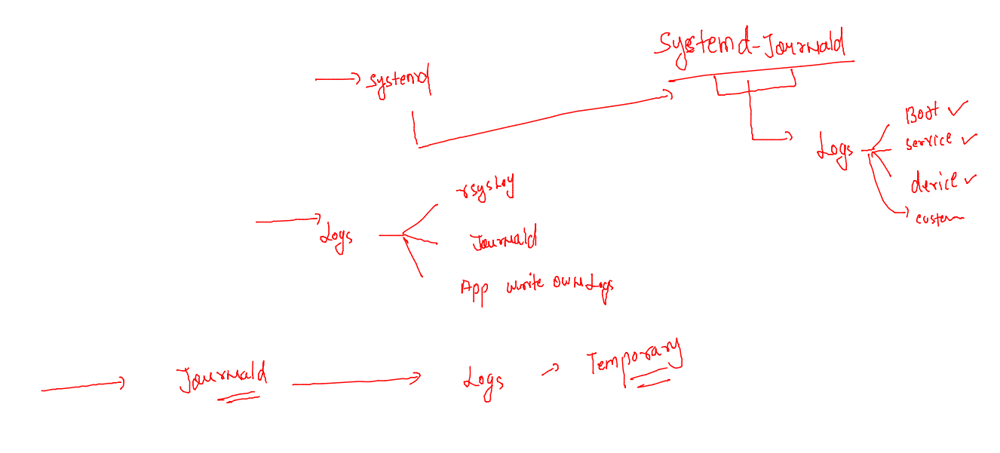

### by default journald store temporary logs 

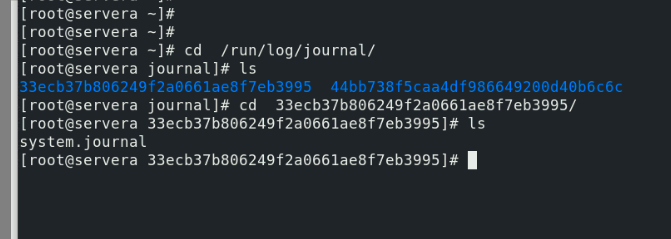

### storage logs 

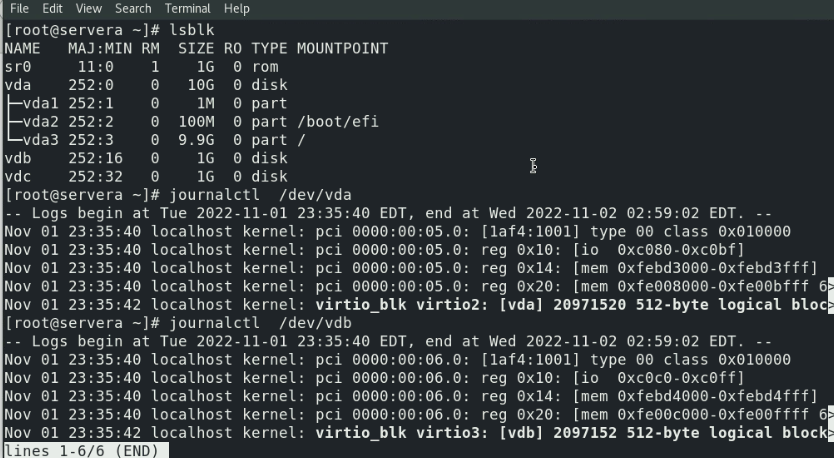

### making persistent journald logging 

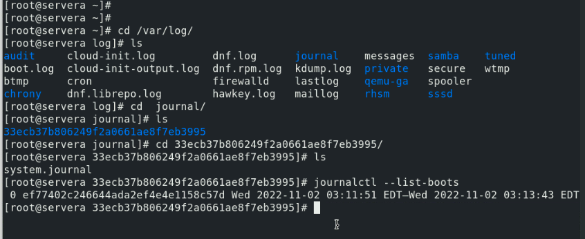

### more on JournalCTL 

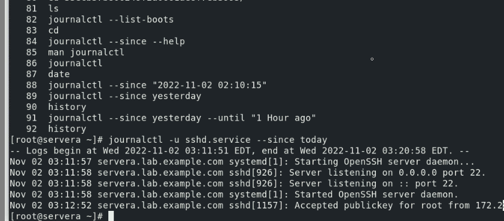

### Journald -- systemd-journald 

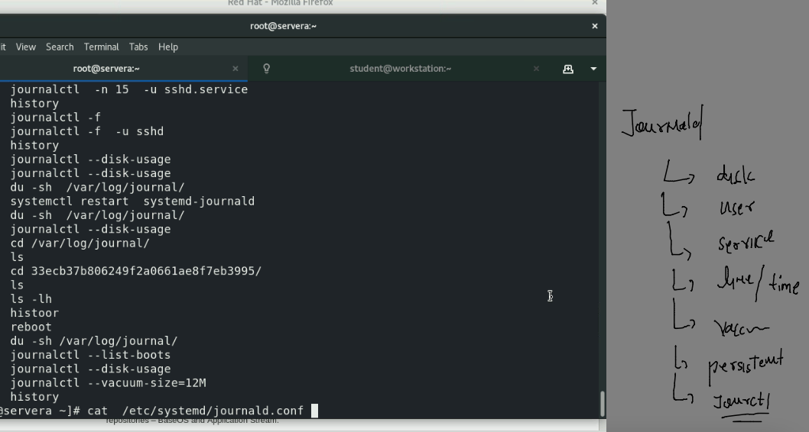

## Introduction to Rsyslog 

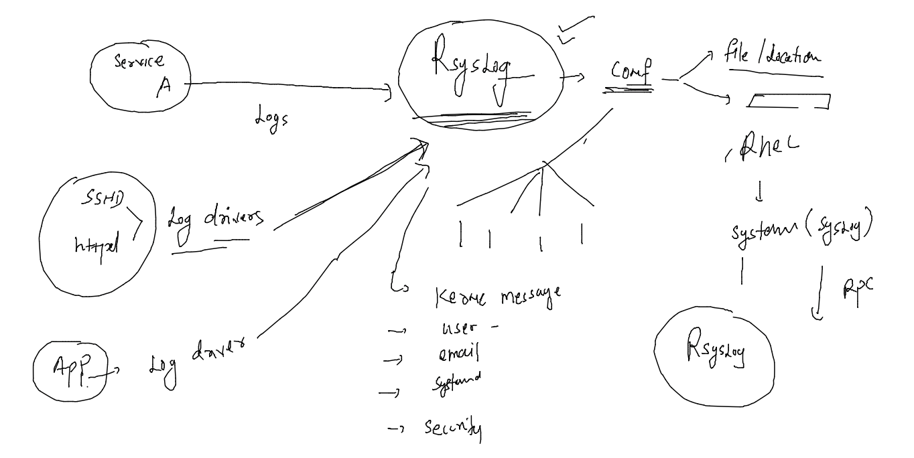

### rsyslog conf 

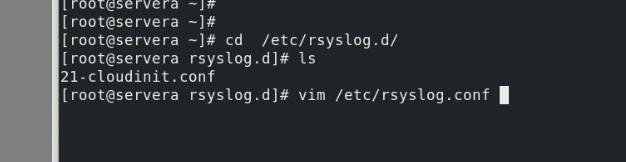

## introducing audit in RHEL 

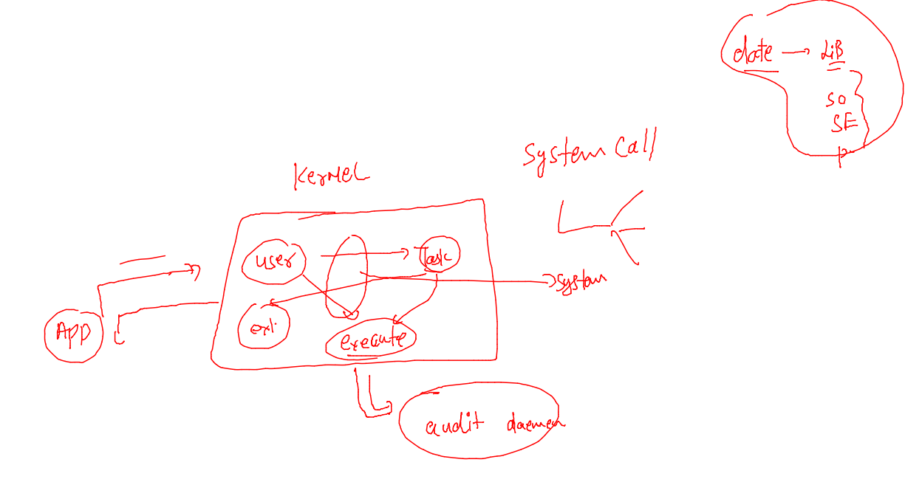

### SElinux context 

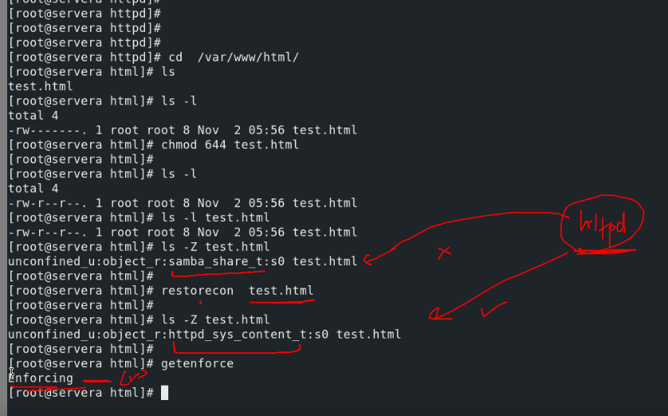

### Selinux more info 

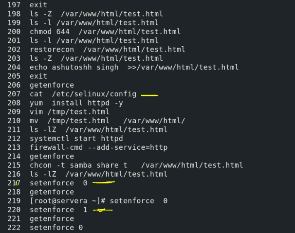

## System Monitoring & console managemnt 

### enable cockpit 

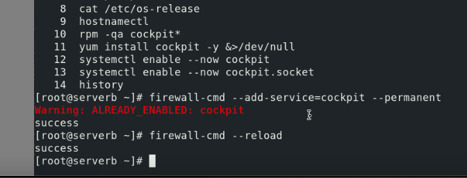

### installing add-ons in cockpit 

