## Training plan 

### Understanding Network tools and Issues in RHEL 

### checking network internface details 

### checking details of network profile and device using nmcli

### Network configuration location 

### using ping utility 

### ICMP block 

## Using Nmap to check host and its port & service status 

### firewalld 

### Network traffic analyzer 

### tcpdump for packet capture 

## RPM issues 

### Understanding rpm and yum repo 

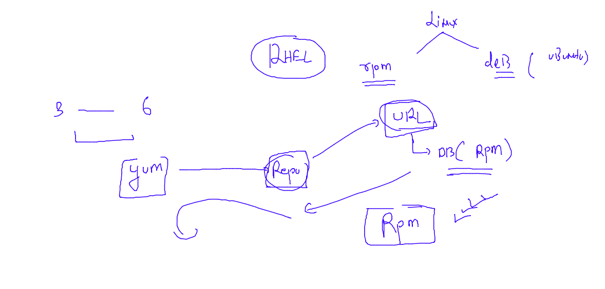

### checking dependency of yum package 

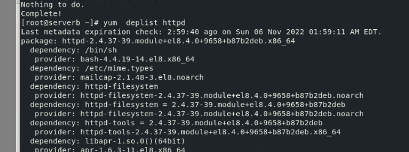

### checking yum history and info 

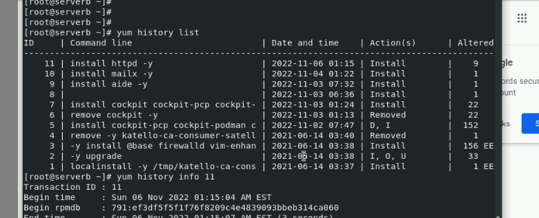

### checking rpm options 

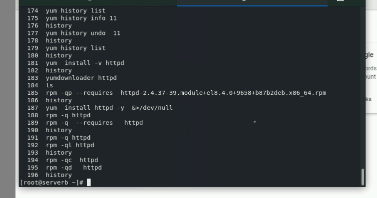

### case 

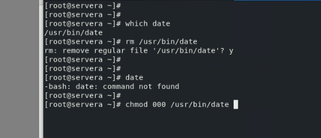

### yum & rpm tips 

===
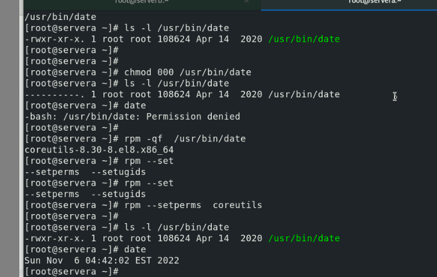

### listing duplicacy 

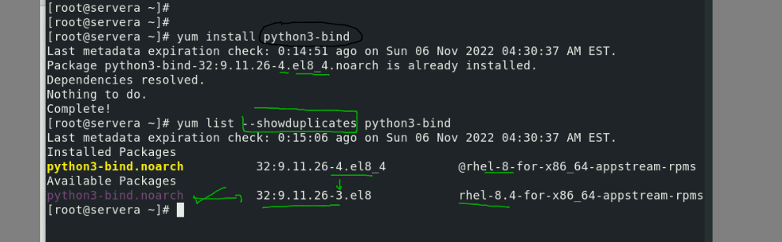

### yum version lock

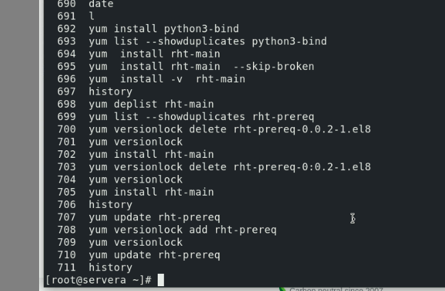

### task case 

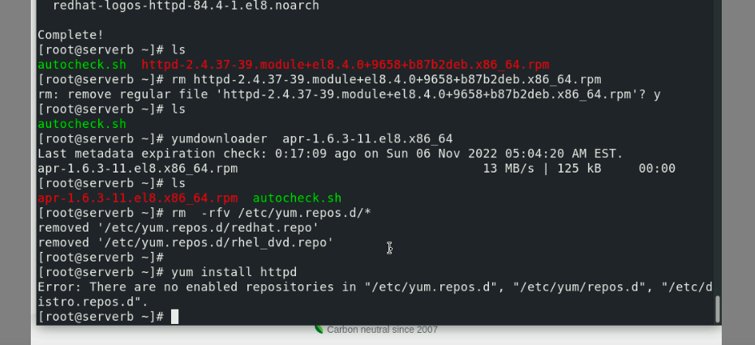

## application need library to make syscalls -- and we can use strace to see syscall

### using ldd to check required libs while running that app / command 

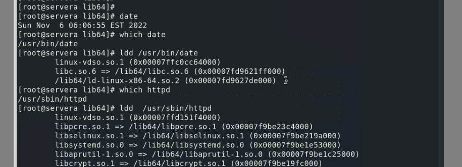

### checking lib issues 

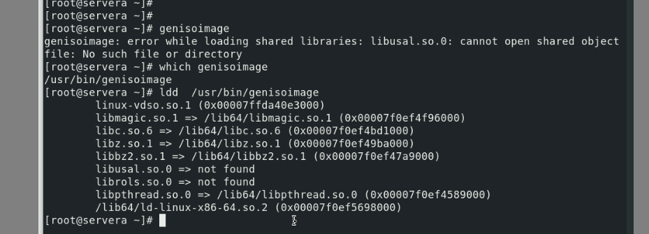

### ldd based solving problem 

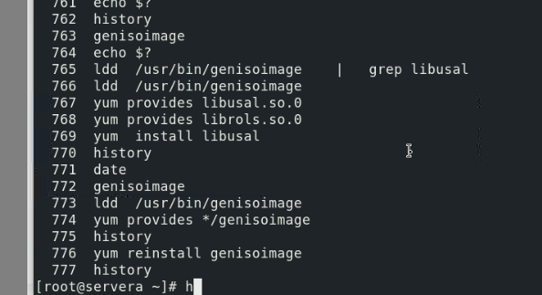

## Kdump process in OS crash 

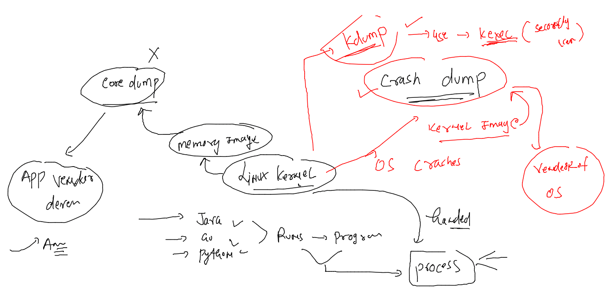

### checking all kdump process

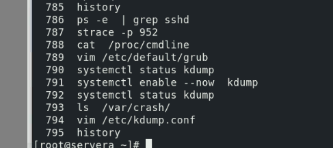

### OOM and process hang configure manager

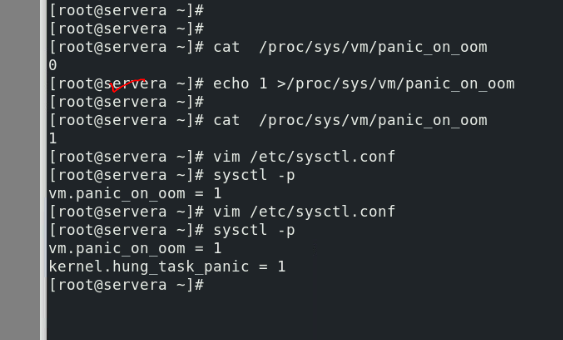

