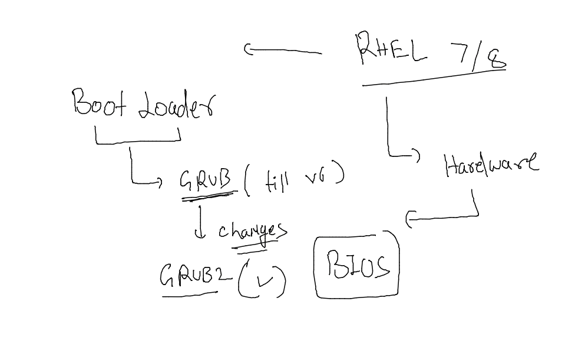

## Training plan 

## REvision 

### tip to automate alerting 

### topics 

### understanding BIOS -- os boot process 

### BIOS -- boot - partition table 

### MBR vs GPT 

## GRand Unified Boot loader (GRUB)

### GRUB2 with BIOS 

### file to changes grub2 related content 

### boot argument changing 

### recreating grub.cfg 

## recover root password on RHEL 7 / 8 

### select boot loader while booting and pass two argument 

### in emergency shell we run below commands 

### loging with root and do restart con

### grubby utility 

## info about UEFI firmware 

### EFI / UEFI based grub2 

### setting grub password to prevent live kernel parameter passing 

### run-level vs targets 

### changing target in workstation machine 

### listing dependency in image format 

## Creating custom service for sample Python flask application 

### sample python flask app 

### finally custom config file 

