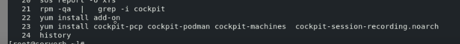

## Training plan 

###  lab ENV 

### steps  / approach to solve problems or troubleshooting 

### collecting of relevent Info -- rhel 6 - 7- 8 

### checking on servera -- for the status rsyslog & systemd-journald

### user need things to login

### checking details for student user

### fixing issues 

## collecting information for troubleshooting --

### understanding logging methods 

### by default journald store temporary logs 

### storage logs 

### making persistent journald logging 

### more on JournalCTL 

### Journald -- systemd-journald 

## Introduction to Rsyslog 

### rsyslog conf 

## introducing audit in RHEL 

### SElinux context 

### Selinux more info 

## System Monitoring & console managemnt 

### enable cockpit 

### installing add-ons in cockpit 

