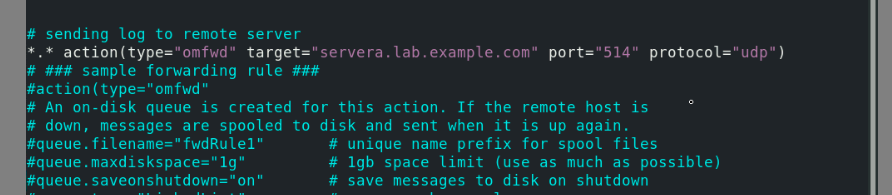

## Training plan 

### Revision of  RHEL stanadard cockpit 

### lets clean up cockpit and reinstall it 

### Reinstalling it 

### lets monitor the performance metrics of RHEL system 

### Session activity recording in RHEL using SSSD along with cockpit 

### login to student user for the same 

### adding port in FIrewalld and selinux context 

## Centralized / Remote logging 

### log severity levels 

### enable remote logging TCP and UDP 

### COnfiguration changes in REmote log server for templating purpose 

### on log client configuration setup 

