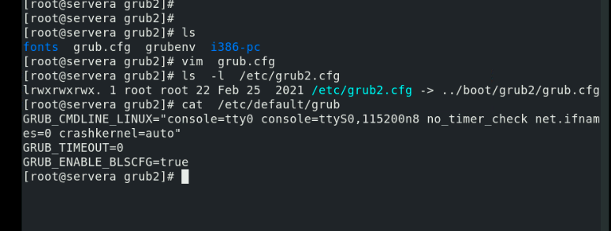
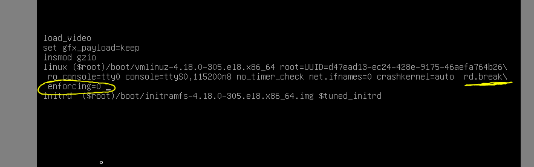

## Training plan 

## REvision 

### tip to automate alerting 

### topics 

### understanding BIOS -- os boot process 

### BIOS -- boot - partition table 

### MBR vs GPT 

## GRand Unified Boot loader (GRUB)

### GRUB2 with BIOS 

### file to changes grub2 related content 

### boot argument changing 

### recreating grub.cfg 

## recover root password on RHEL 7 / 8 

### select boot loader while booting and pass two argument 

### in emergency shell we run below commands 

### loging with root and do restart con

### grubby utility 

