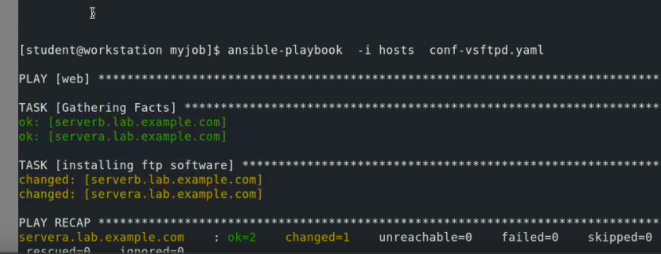

## Training plan 

### Revision of  RHEL stanadard cockpit 

### lets clean up cockpit and reinstall it 

### Reinstalling it 

### lets monitor the performance metrics of RHEL system 

### Session activity recording in RHEL using SSSD along with cockpit 

### login to student user for the same 

### adding port in FIrewalld and selinux context 

## Centralized / Remote logging 

### log severity levels 

### enable remote logging TCP and UDP 

### COnfiguration changes in REmote log server for templating purpose 

### on log client configuration setup 

## Automation engineering 

### Redhat satellite & Ansible 

### Deep look into Ansible 

### Ansible Hosts -- conf

### updating inventory and ansible.cfg file 

### sample adhoc ansible command 

### ansible playbook sample 

### final playbook and lets run it 

### playbook 

### running it 

### final ansible playbook for complte vsftpd setup 

### lets run it 

